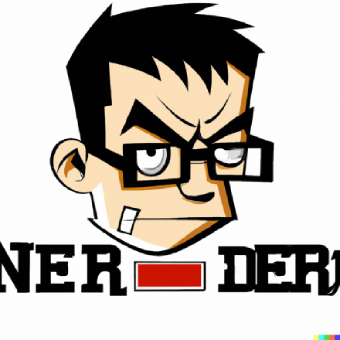

# Test-Driven Kata
An approach to teaching topics with hands-on coding sessions, driven by tests.

## neat-coin
neat-coin is a simplistic, didactic crypto currency for understanding the basis of Blockchain.
